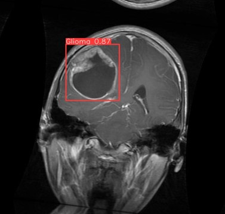
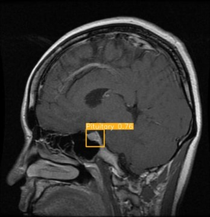
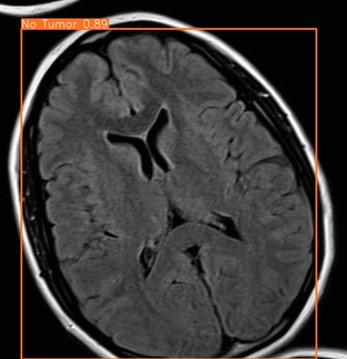
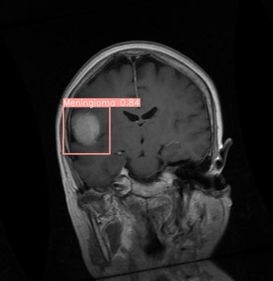
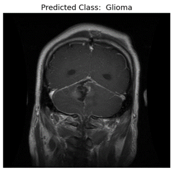
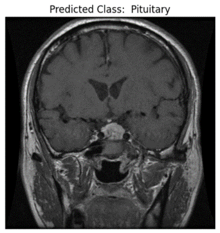
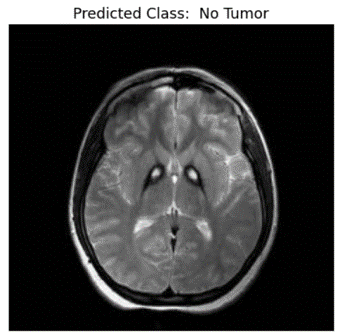
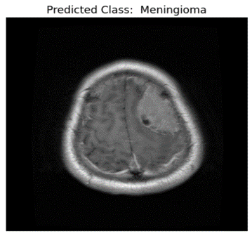
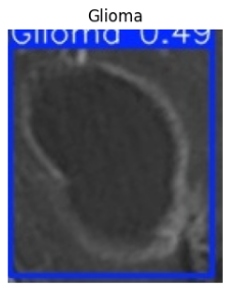
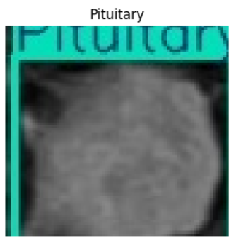

# 🧠 Brain Tumor Detection & Classification

This project aims to detect and classify brain tumors from MRI images using YOLOv8n for object detection and ResNet-50 for classification. It includes a Flask-based user interface for easy interaction.

## 📌 Features

- Tumor detection using YOLOv8n on MRI scans
- 4 Tumor classes: **Glioma**, **Meningioma**, **Pituitary**, **No Tumor**
- Region of Interest (ROI) extraction post-detection
- Classification using ResNet-50
- Flask Web UI for uploading MRI scans and viewing results

## 🧠 Models Used

- **YOLOv8n**: for tumor detection
- **ResNet-50**: for tumor classification

## 🖼 Sample MRI Classes

- Glioma
- Meningioma
- Pituitary
- No Tumor

## 🚀 Technologies Used

- Python
- YOLOv8n (Ultralytics)
- OpenCV
- PyTorch
- Flask (for web UI)
- NumPy, Pandas, Matplotlib

## 📈 YOLOv8n Detection Results
The following images show the tumor detection results using YOLOv8n.

| YOLOv8n Detection 1 | YOLOv8n Detection 2 | YOLOv8n Detection 3 | YOLOv8n Detection 4 |
|---------------------|---------------------|---------------------|---------------------|
|  |  |  |  |

---

## 🔍 ResNet50 Classification Results
The following images show the tumor classification results using ResNet50.

| ResNet50 Classification 1  | ResNet50 Classification 2  | ResNet50 Classification 3  | ResNet50 Classification 4  |
|-------|-------|-------|-------|
|  |  |  |  |

---

## 🔄 Integrated YOLOv8n + ResNet50 Results
We extracted the Region of Interest (ROI) from the detected tumors and passed them through ResNet50 for classification.
The following images demonstrate the integration of tumor detection by YOLOv8n and classification by ResNet50.

| Integrated Result 1 | Integrated Result 2 |
|--------------------|--------------------|
|  |  |

## 📸 UI Preview

## 💻 How to Run Flask

cd Flask_Web

python webapp.py

